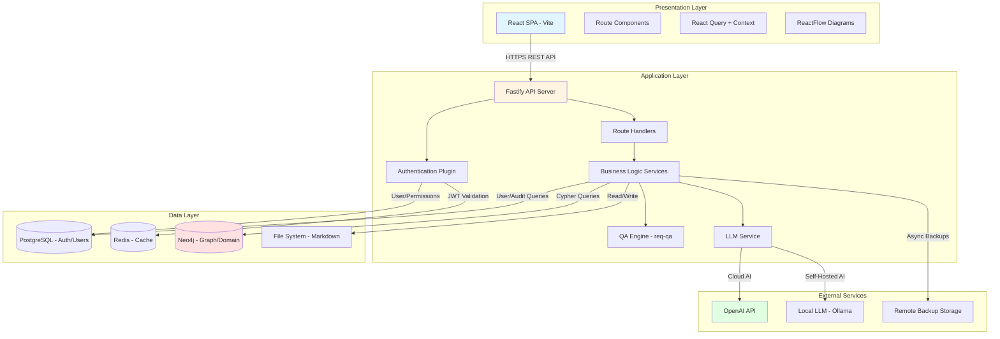
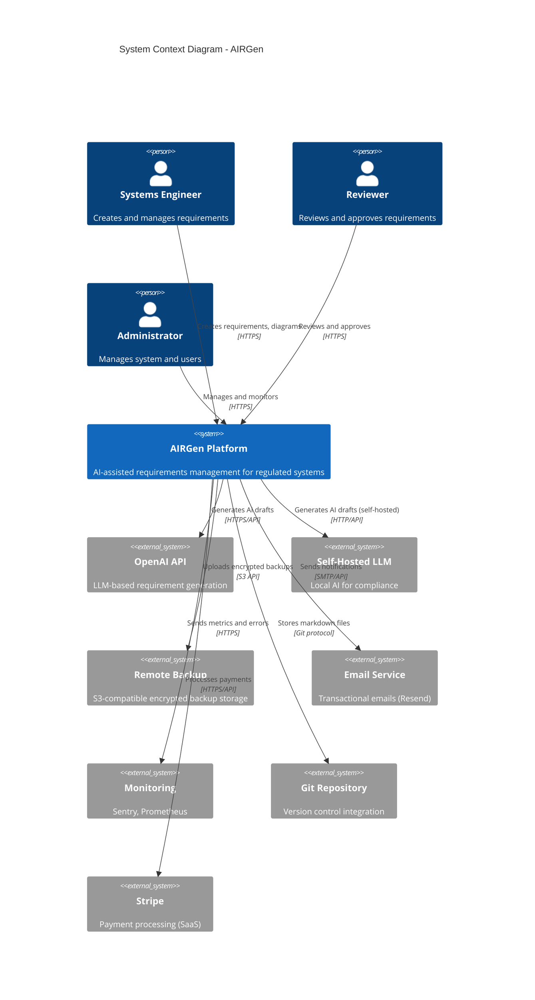
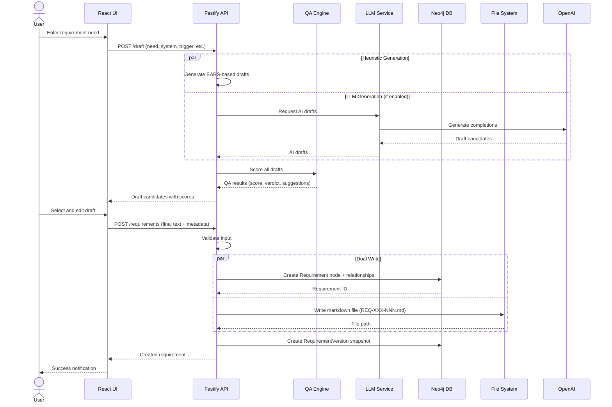
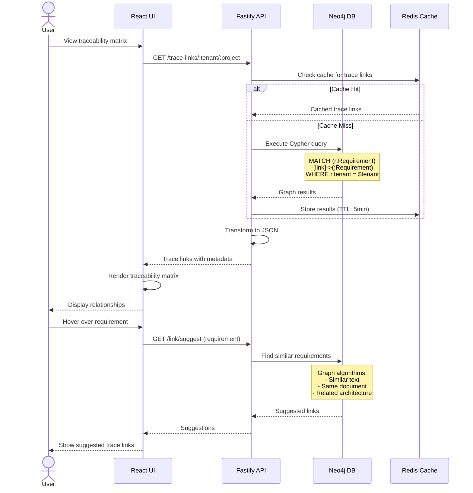
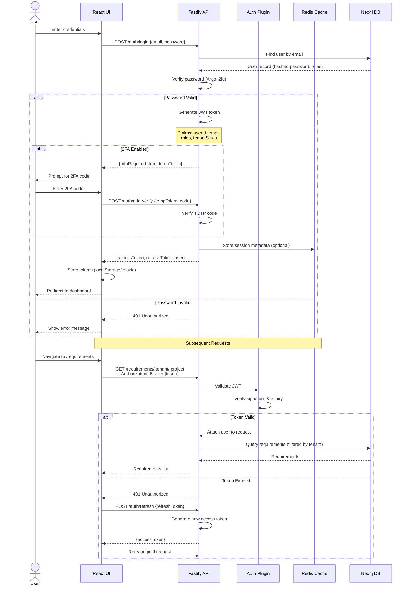
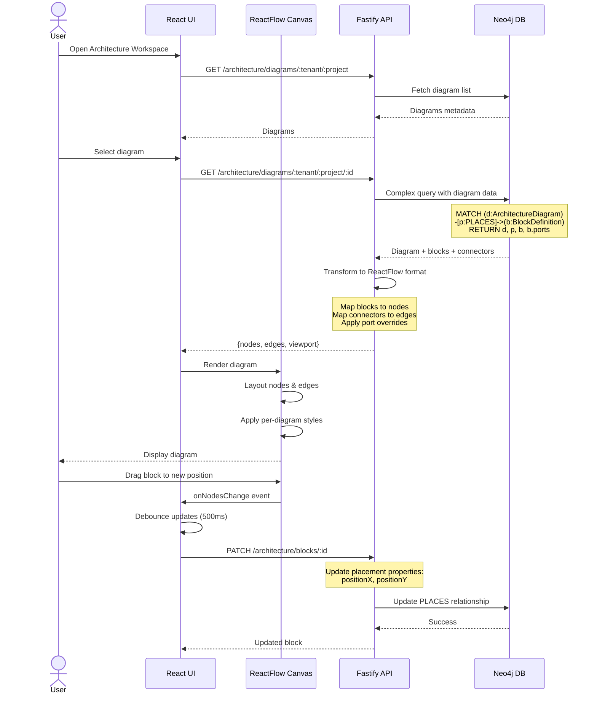
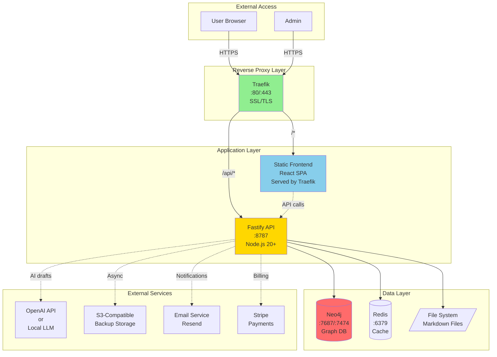
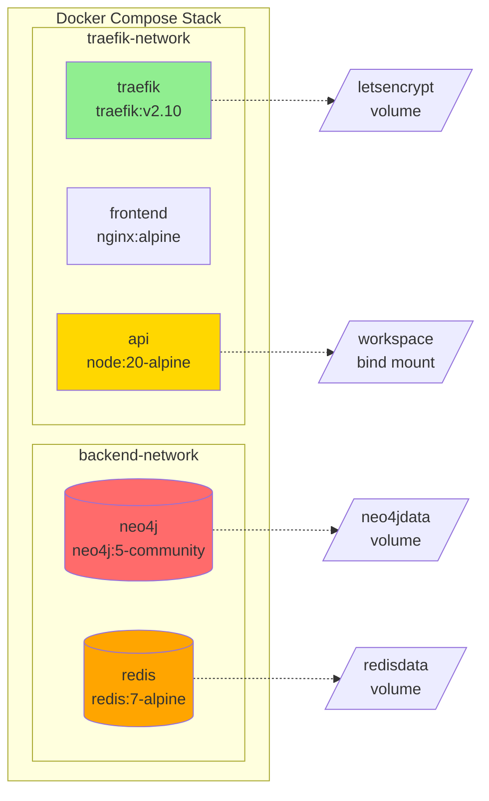
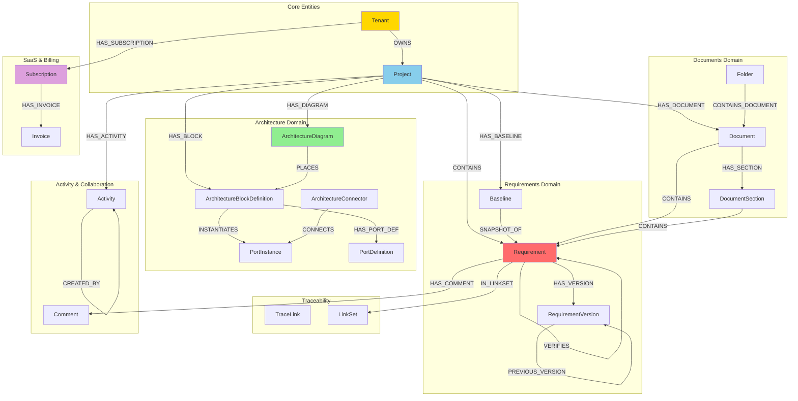

# AIRGen Design Description Document

**Version:** 1.3
**Last Updated:** 2025-10-23
**Status:** Living Document

## Table of Contents

1. [Executive Summary](#executive-summary)
2. [System Overview](#system-overview)
3. [Architecture Design](#architecture-design)
4. [Component Design](#component-design)
5. [Data Design](#data-design)
6. [Interface Design](#interface-design)
7. [Security Design](#security-design)
8. [Deployment Design](#deployment-design)
9. [Design Decisions](#design-decisions)
10. [Future Considerations](#future-considerations)

---

## 1. Executive Summary

### 1.1 Purpose

AIRGen is an AI-assisted requirements generation and management system designed for engineering teams working on safety-critical and regulated systems. The system facilitates the transition from stakeholder needs to compliant, testable requirements while maintaining full traceability and supporting ISO/IEC/IEEE 29148 standards.

### 1.2 Scope

This Design Description Document (DDD) describes the complete system architecture, component interactions, data models, interfaces, and deployment strategies for AIRGen. It serves as the authoritative technical reference for developers, architects, and system administrators.

### 1.3 Key Design Goals

- **Deterministic Quality Assurance**: Provide repeatable, rule-based QA without relying solely on AI
- **Graph-Based Traceability**: Enable rich relationship queries through Neo4j
- **AI Augmentation**: Leverage LLMs to accelerate requirement generation while maintaining quality
- **Multi-Tenancy**: Support isolated workspaces for different organizations and projects
- **Flexible Deployment**: Available as SaaS (airgen.studio), self-hosted, or managed hosting
- **Production-Ready**: Battle-tested architecture with enterprise security and compliance features

---

## 2. System Overview

### 2.1 High-Level Architecture

AIRGen follows a **three-tier architecture** with clear separation of concerns:



**Architecture Characteristics:**

- **Modular Monolith**: Logically separated components in single deployment
- **Stateless API**: JWT-based authentication, horizontal scaling ready
- **Polyglot Persistence**: PostgreSQL for users/auth, Neo4j for domain graph, Redis for caching, Markdown for content
- **Flexible AI**: Supports cloud LLM (OpenAI) or self-hosted (Ollama/vLLM)
- **Multi-Tenant**: Complete data isolation per tenant

### 2.2 System Context



**External Actors:**
- **Engineers**: Create, review, and manage requirements, diagrams, and documents
- **Reviewers**: Approve baselines, create trace links, quality assurance
- **System Administrators**: Deploy, configure, monitor system, manage users and backups
- **Product Managers**: Define needs, track requirements progress

**External Services:**
- **AI Providers**: OpenAI (cloud) or Ollama/vLLM (self-hosted) for requirement generation
- **Payment Processing**: Stripe for SaaS billing and subscriptions
- **Email Service**: Resend for transactional emails (verification, notifications)
- **Monitoring**: Sentry (errors), Prometheus/Grafana (metrics) - optional
- **Backup Storage**: S3-compatible storage (DigitalOcean Spaces, AWS S3, Backblaze B2)
- **Version Control**: Git repositories for markdown file tracking

### 2.3 Core Capabilities

1. **Requirements Management**
   - CRUD operations for requirements
   - Complete version history with audit trail and diff capabilities
   - Versioning through baselines
   - Archive/unarchive workflows
   - Duplicate detection
   - Background QA scorer worker for bulk quality analysis

2. **AI-Assisted Generation**
   - Template-based heuristic drafts (EARS patterns)
   - LLM-powered drafts with deterministic QA
   - Candidate review and acceptance workflow

3. **Document Management**
   - Structured documents with sections
   - Surrogate document uploads (PDF, Word, etc.)
   - Hierarchical folder organization
   - Document-to-requirement linking

4. **Traceability**
   - Typed trace links (satisfies, derives, verifies, etc.)
   - Linkset management for organized traceability
   - Graph-based link suggestions
   - Broken link detection

5. **Architecture Diagrams**
   - Visual system architecture modeling
   - Reusable block library with ports
   - Per-diagram layout and styling
   - Connector relationships with labels
   - Floating diagram windows
   - Diagram snapshot capture

6. **AI Visual Generation (Imagine)**
   - AI-powered image generation from requirements
   - Visual mockups for UI/UX requirements
   - Diagram generation from architecture descriptions
   - Context-aware image creation using vision AI
   - Integration with document management

7. **Activity Tracking**
   - Real-time activity feed for project changes
   - User action history and audit trail
   - Requirement modification tracking
   - Collaboration visibility across teams
   - Filterable activity streams by type and user

8. **Subscription & Billing (SaaS)**
   - Freemium model with tiered plans (Free, Pro, Enterprise)
   - Stripe integration for payment processing
   - Usage-based limits and enforcement
   - Self-service subscription management
   - Billing analytics and reporting

9. **AI Compliance & Security**
   - Flexible AI deployment options (cloud, self-hosted, disabled)
   - ITAR/HIPAA/regulatory compliance support
   - Data sovereignty controls
   - Per-project AI enablement settings
   - Comprehensive audit logging for AI usage

---

## 3. Architecture Design

### 3.1 Architectural Style

**Microservices-Inspired Monolith**

AIRGen uses a **modular monolith** approach where components are logically separated but deployed as a single application. This provides:
- Simplified deployment and operations
- Strong consistency guarantees
- Reduced network latency
- Easier debugging and testing

Future scaling can transition to microservices if needed.

### 3.2 Component Architecture

#### 3.2.1 Backend Service (Fastify API)

**Technology Stack:**
- **Runtime**: Node.js 20+
- **Framework**: Fastify 4.x (high-performance HTTP)
- **Language**: TypeScript with strict mode
- **Module System**: ES Modules

**Key Modules:**
- `routes/`: HTTP endpoint handlers organized by feature
- `services/`: Business logic and external service integrations
  - `graph/`: Neo4j database operations
  - `llm.ts`: LLM provider abstraction
  - `workspace.ts`: Markdown file operations
- `lib/`: Shared utilities (logging, validation, metrics)
- `plugins/`: Fastify plugins (auth, CORS, rate limiting)

**Design Patterns:**
- **Repository Pattern**: Graph services abstract Neo4j queries
- **Factory Pattern**: LLM service creates provider-specific clients
- **Decorator Pattern**: Metrics tracking wraps service methods

#### 3.2.2 Frontend Application (React SPA)

**Technology Stack:**
- **Framework**: React 18 with functional components
- **Build Tool**: Vite 5.x
- **Language**: TypeScript
- **State Management**: React Query + Context API
- **Routing**: React Router v6
- **UI Components**: Custom components + Radix UI primitives

**Key Modules:**
- `routes/`: Page-level components organized by feature
- `components/`: Reusable UI components
  - `diagram/`: Shared diagram canvas (ReactFlow)
  - `FloatingDocumentWindow.tsx`: Floating window system
  - `MarkdownEditor.tsx`: Rich text editing with Monaco
- `contexts/`: Global state providers
- `hooks/`: Custom React hooks
- `lib/`: API client and utilities

**Design Patterns:**
- **Component Composition**: Small, composable components
- **Render Props**: Flexible component APIs
- **Custom Hooks**: Encapsulated state logic
- **Context Providers**: Scoped global state

#### 3.2.3 QA Engine (Deterministic Rules)

**Location**: `packages/req-qa/`

**Purpose**: Standalone TypeScript library providing ISO 29148-aligned quality checks without AI dependencies.

**Rule Categories:**
1. **Clarity**: Ambiguous terms detection (e.g., "appropriate", "timely")
2. **Completeness**: Missing patterns or verification methods
3. **Consistency**: Conflicting statements
4. **Correctness**: Grammar and formatting issues
5. **Verifiability**: Measurable acceptance criteria

**Output**: Scored requirements (0-100) with actionable suggestions.

### 3.3 Data Flow

#### 3.3.1 Requirement Creation Flow



#### 3.3.2 Traceability Query Flow



#### 3.3.3 Authentication Flow



#### 3.3.4 Diagram Rendering Flow



### 3.4 Deployment Architecture



**Container Architecture:**



**Development Setup:**
- Frontend: Vite dev server (:5173) with HMR and API proxy
- Backend: tsx watch mode (:8787) with hot reload
- Neo4j: Docker (:7687/:7474) with dev credentials
- Redis: Docker (:6379) optional for caching tests

---

## 4. Component Design

### 4.1 Backend Components

#### 4.1.1 Authentication Plugin

**File**: `backend/src/plugins/auth.ts`

**Responsibilities:**
- JWT token validation
- User session management
- Role-based access control (RBAC)
- Request user context injection

**Key Methods:**
```typescript
app.authenticate        // Validates JWT, attaches user to request
app.optionalAuthenticate // Validates if present, continues if not
app.requireRole(role)   // Enforces role requirement
app.requireAnyRole([])  // Enforces at least one role
```

**Security Features:**
- Token expiry validation
- Multi-tenant scope enforcement
- Role hierarchy (admin > author > reviewer > user)

#### 4.1.2 Graph Service Layer

**Files**: `backend/src/services/graph/*.ts`

**Pattern**: Repository pattern with Cypher query encapsulation

**Key Services:**
- `requirements.ts`: Requirement CRUD and queries
- `projects.ts`: Tenant and project management
- `baselines.ts`: Baseline snapshots
- `trace-links.ts`: Traceability relationship management
- `documents.ts`: Document and section management
- `architecture/`: Diagram, block, and connector operations

**Transaction Management:**
```typescript
const session = getSession();
try {
  const result = await session.run(query, params);
  return mapResults(result);
} finally {
  await session.close();
}
```

#### 4.1.3 LLM Service (Hybrid Architecture)

**File**: `backend/src/services/llm.ts`

**Purpose**: Abstract LLM provider interactions with compliance-aware backend selection

**Architecture**: The LLM service implements a **hybrid architecture** allowing customers to choose their AI backend based on compliance requirements, budget, and data sensitivity:

**Supported Backends:**

1. **OpenAI Cloud (Default)**
   - Providers: GPT-4o-mini, GPT-4o, GPT-4
   - Best quality and ease of use
   - Suitable for: Non-regulated industries, commercial projects
   - Configuration: `OPENAI_API_KEY` environment variable
   - Compliance: ⚠️ Not suitable for ITAR, classified, or highly regulated data

2. **Self-Hosted LLM (Ollama/vLLM)**
   - Models: Llama 3.1 8B/70B, Mistral, CodeLlama, or custom
   - Complete data control - requirements never leave customer infrastructure
   - Suitable for: ITAR-controlled defense projects, classified environments, HIPAA (without BAA), automotive NDAs
   - Configuration: `OLLAMA_API_BASE` or `VLLM_API_BASE` environment variable
   - Deployment: Docker Compose service or external server with GPU
   - Compliance: ✅ Suitable for all regulated industries

3. **Disabled Mode**
   - No AI features - pure deterministic heuristics only
   - Suitable for: Maximum security, air-gapped environments
   - Configuration: Omit all AI provider environment variables
   - Compliance: ✅ No data transmission risks

**Provider Selection Logic:**
```typescript
function selectLLMProvider(): LLMProvider {
  if (process.env.OLLAMA_API_BASE) return new OllamaProvider();
  if (process.env.VLLM_API_BASE) return new VLLMProvider();
  if (process.env.OPENAI_API_KEY) return new OpenAIProvider();
  return new DisabledProvider(); // Fallback to heuristics only
}
```

**Key Operations:**
```typescript
generateRequirementDrafts(input)  // Structured prompt → drafts
generateImageAnalysis(imageUrl)   // Vision API for image attachments
embedText(text)                   // Future: vector embeddings for semantic search
```

**Error Handling:**
- Graceful degradation: Always fall back to heuristic drafts if AI fails
- Rate limit retry with exponential backoff (OpenAI)
- Timeout protection (30s default, 60s for vision)
- Provider-specific error mapping (OpenAI errors vs Ollama errors)

**Compliance Benefits:**
- **Competitive Differentiation**: Only AI requirements tool supporting ITAR/classified environments
- **Customer Choice**: Let customers balance quality, cost, and compliance
- **Audit Trail**: All AI requests logged with provider, model, and timestamp
- **Data Sovereignty**: Self-hosted option ensures data never leaves customer control

#### 4.1.4 Workspace Service

**File**: `backend/src/services/workspace.ts`

**Responsibilities:**
- Markdown file I/O
- YAML front matter serialization
- Directory structure management
- Git-friendly file naming

**File Structure:**
```
workspace/
  <tenant>/
    <project>/
      requirements/
        REQ-<KEY>-001.md
        REQ-<KEY>-002.md
      documents/
        <document-slug>/
          <filename>.pdf
```

**Front Matter Example:**
```yaml
---
id: "uuid"
ref: "REQ-BRK-001"
title: "Brake Response Time"
pattern: "event"
verification: "Test"
qaScore: 85.5
qaVerdict: "good"
createdAt: "2025-10-06T12:00:00Z"
updatedAt: "2025-10-06T12:30:00Z"
---

When brake pedal force exceeds 50 N, the system shall...
```

### 4.2 Frontend Components

#### 4.2.1 Diagram Canvas (Shared)

**File**: `frontend/src/components/diagram/DiagramCanvas.tsx`

**Purpose**: Reusable ReactFlow-based diagram renderer

**Features:**
- Node and edge rendering
- Drag-and-drop interaction
- Zoom/pan with minimap
- Context menus
- Selection management
- Viewport persistence per diagram
- Port override visualization
- Connector label positioning

**Integration Points:**
- Architecture diagrams (block diagrams)
- Interface diagrams (data flow)
- Custom node types via props

**Props:**
```typescript
interface DiagramCanvasProps {
  nodes: Node[];
  edges: Edge[];
  onNodesChange: (changes: NodeChange[]) => void;
  onEdgesChange: (changes: EdgeChange[]) => void;
  viewport?: Viewport;
  onViewportChange?: (viewport: Viewport) => void;
  nodeTypes?: NodeTypes;
  edgeTypes?: EdgeTypes;
}
```

#### 4.2.2 Floating Window System

**File**: `frontend/src/contexts/FloatingDocumentsContext.tsx`

**Purpose**: Multi-window document/diagram viewing

**Features:**
- Draggable, resizable windows
- Z-index management
- Window state persistence (optional)
- Support for documents and diagrams
- Snapshot capture from diagrams

**Window Types:**
```typescript
type FloatingDocumentType = 'structured' | 'surrogate' | 'diagram';

interface FloatingDocument {
  documentSlug: string;
  documentName: string;
  tenant: string;
  project: string;
  kind: FloatingDocumentType;
  // Additional type-specific properties
}
```

#### 4.2.3 Markdown Editor

**File**: `frontend/src/components/MarkdownEditor.tsx`

**Technology**: Monaco Editor (VS Code engine)

**Features:**
- Syntax highlighting
- Live preview
- Keyboard shortcuts
- Undo/redo
- Search/replace
- Theme support (light/dark)

**Integration**: Used in requirement editing, document authoring

#### 4.2.4 API Client

**File**: `frontend/src/lib/client.ts`

**Pattern**: Class-based API wrapper with error handling

**Key Methods:**
```typescript
class APIClient {
  // Authentication
  login(credentials): Promise<LoginResponse>
  getCurrentUser(): Promise<User>

  // Requirements
  listRequirements(tenant, project): Promise<Requirement[]>
  createRequirement(data): Promise<Requirement>
  updateRequirement(id, data): Promise<Requirement>

  // Drafts
  generateDrafts(input): Promise<Draft[]>

  // Trace links
  createTraceLink(data): Promise<TraceLink>
  suggestLinks(requirement): Promise<Suggestion[]>

  // Diagrams
  listDiagrams(tenant, project): Promise<Diagram[]>
  createDiagram(data): Promise<Diagram>
  updateBlock(id, data): Promise<Block>
}
```

**Error Handling:**
- Automatic token refresh
- Network error retry
- User-friendly error messages
- Toast notifications

---

## 5. Data Design

AIRGen uses a **polyglot persistence** architecture with three complementary databases:

- **PostgreSQL**: User accounts, authentication, permissions, audit logs, backup metadata
- **Neo4j**: Requirements, documents, architecture, traceability graph (domain model)
- **Redis**: Session caching, JWT token validation
- **File System**: Markdown files for requirement content

### 5.1 Relational Database (PostgreSQL)

PostgreSQL stores authentication, authorization, and operational data that benefits from ACID transactions and relational integrity.

#### 5.1.1 Tables Overview

**users**
```sql
CREATE TABLE users (
  id UUID PRIMARY KEY,
  email VARCHAR(255) UNIQUE NOT NULL,
  name VARCHAR(255),
  password_hash TEXT NOT NULL,        -- Argon2id
  email_verified BOOLEAN DEFAULT false,
  mfa_enabled BOOLEAN DEFAULT false,
  mfa_secret TEXT,                    -- Encrypted TOTP secret
  created_at TIMESTAMP NOT NULL,
  updated_at TIMESTAMP NOT NULL,
  deleted_at TIMESTAMP                -- Soft delete
);
```

**user_permissions**
```sql
CREATE TABLE user_permissions (
  id UUID PRIMARY KEY,
  user_id UUID REFERENCES users(id),
  tenant_slug VARCHAR(255),           -- NULL = global permission
  project_slug VARCHAR(255),          -- NULL = tenant-level permission
  role VARCHAR(50) NOT NULL,          -- super-admin|admin|author|viewer
  is_owner BOOLEAN DEFAULT false,     -- Tenant ownership flag
  created_at TIMESTAMP NOT NULL,
  updated_at TIMESTAMP NOT NULL,
  UNIQUE(user_id, tenant_slug, project_slug)
);
```

**refresh_tokens**
```sql
CREATE TABLE refresh_tokens (
  id UUID PRIMARY KEY,
  user_id UUID REFERENCES users(id),
  token_hash TEXT NOT NULL,           -- SHA-256 hash
  expires_at TIMESTAMP NOT NULL,
  created_at TIMESTAMP NOT NULL,
  revoked_at TIMESTAMP                -- Token revocation
);
```

**mfa_backup_codes**
```sql
CREATE TABLE mfa_backup_codes (
  id UUID PRIMARY KEY,
  user_id UUID REFERENCES users(id),
  code_hash TEXT NOT NULL,            -- Argon2id hash
  used_at TIMESTAMP,                  -- NULL = unused
  created_at TIMESTAMP NOT NULL
);
```

**audit_logs**
```sql
CREATE TABLE audit_logs (
  id UUID PRIMARY KEY,
  user_id UUID REFERENCES users(id),
  action VARCHAR(100) NOT NULL,       -- login|logout|password_change|permission_grant|etc.
  resource_type VARCHAR(50),          -- user|tenant|project|etc.
  resource_id VARCHAR(255),
  metadata JSONB,                     -- Additional context
  ip_address INET,
  user_agent TEXT,
  created_at TIMESTAMP NOT NULL
);
```

**project_backups**
```sql
CREATE TABLE project_backups (
  id UUID PRIMARY KEY,
  tenant_slug VARCHAR(255) NOT NULL,
  project_slug VARCHAR(255) NOT NULL,
  backup_type VARCHAR(50) NOT NULL,   -- manual|scheduled|pre-delete
  storage_path TEXT NOT NULL,         -- S3/Spaces object key
  size_bytes BIGINT,
  checksum TEXT,                      -- SHA-256 of backup file
  status VARCHAR(50) NOT NULL,        -- pending|uploading|completed|failed
  error_message TEXT,
  created_by UUID REFERENCES users(id),
  created_at TIMESTAMP NOT NULL,
  completed_at TIMESTAMP
);
```

#### 5.1.2 Permission Model

PostgreSQL manages a hierarchical permission system:

1. **Global Permissions**: `super-admin` role (full system access)
2. **Tenant Permissions**: Owner or member of specific tenant
3. **Project Permissions**: Role-based access within projects
   - `admin`: Full project management
   - `author`: Create/edit requirements, diagrams
   - `viewer`: Read-only access

**Permission Inheritance:**
- Super-admins have implicit access to all tenants and projects
- Tenant owners have implicit `admin` role on all tenant projects
- Project permissions are explicitly granted per user

#### 5.1.3 Authentication Flow

1. **Login**: Validate email/password against `users` table
2. **MFA** (optional): Verify TOTP code using `mfa_secret`
3. **JWT Generation**: Build payload from `user_permissions`
4. **Refresh Token**: Store in `refresh_tokens` table with 30-day expiry
5. **Token Caching**: Cache JWT validation results in Redis (5 min TTL)

### 5.2 Graph Database Schema (Neo4j)



**Schema Overview:**

The Neo4j graph database stores the domain model, relationships, and version history. The schema supports:

- **Multi-tenancy**: Complete data isolation via Tenant nodes
- **Rich traceability**: Typed relationships between requirements (SATISFIES, DERIVES, etc.)
- **Version history**: Immutable RequirementVersion nodes with full snapshots
- **Flexible architecture**: Reusable block definitions with per-diagram placements
- **Activity tracking**: Complete audit trail of all changes (users stored in PostgreSQL)
- **SaaS billing**: Subscription and usage tracking (when enabled)

Note: User authentication, permissions, and MFA are managed in PostgreSQL (see section 5.1).

#### 5.2.1 Core Node Types

**Tenant**
```cypher
(:Tenant {
  slug: String!,           // Unique identifier
  name: String?,
  createdAt: DateTime!
})
```

**Project**
```cypher
(:Project {
  slug: String!,           // Unique within tenant
  tenantSlug: String!,
  key: String?,            // Short code (e.g., "BRK")
  createdAt: DateTime!
})
```

**Requirement**
```cypher
(:Requirement {
  id: String!,             // UUID
  hashId: String!,         // Content hash for deduplication
  ref: String!,            // REQ-XXX-NNN
  tenant: String!,
  projectKey: String!,
  text: String!,           // Requirement statement
  pattern: String?,        // ubiquitous|event|state|unwanted|optional
  verification: String?,   // Test|Analysis|Inspection|Demonstration
  qaScore: Float?,
  qaVerdict: String?,
  suggestions: [String],
  tags: [String],
  attributes: Object?,     // Custom project-specific attributes
  path: String!,           // Markdown file path
  documentSlug: String?,
  archived: Boolean,       // Soft archive flag
  deleted: Boolean,        // Soft delete flag
  createdBy: String?,      // User who created
  updatedBy: String?,      // User who last updated
  createdAt: DateTime!,
  updatedAt: DateTime!,
  contentHash: String!     // SHA-256 hash for drift detection
})
```

**RequirementVersion**
```cypher
(:RequirementVersion {
  versionId: String!,      // UUID for this version
  requirementId: String!,  // Link to parent Requirement.id
  versionNumber: Integer!, // Auto-incremented (1, 2, 3...)
  timestamp: DateTime!,    // When this version was created
  changedBy: String!,      // User who made the change
  changeType: String!,     // created|updated|archived|restored|deleted
  changeDescription: String?, // Optional description
  // Snapshot of requirement state at this version
  text: String!,
  pattern: String?,
  verification: String?,
  rationale: String?,
  complianceStatus: String?,
  complianceRationale: String?,
  qaScore: Float?,
  qaVerdict: String?,
  suggestions: String?,    // JSON stringified
  tags: String?,           // JSON stringified
  attributes: String?,     // JSON stringified
  contentHash: String!
})
```

**Document**
```cypher
(:Document {
  id: String!,
  slug: String!,
  name: String!,
  description: String?,
  shortCode: String?,      // e.g., "SRD", "URD"
  tenant: String!,
  projectKey: String!,
  kind: String!,           // structured|surrogate
  // Surrogate-specific fields
  originalFileName: String?,
  storedFileName: String?,
  mimeType: String?,
  fileSize: Integer?,
  storagePath: String?,
  createdAt: DateTime!,
  updatedAt: DateTime!
})
```

**ArchitectureDiagram**
```cypher
(:ArchitectureDiagram {
  id: String!,
  name: String!,
  description: String?,
  tenant: String!,
  projectKey: String!,
  view: String!,           // block|internal|deployment|requirements_schema
  createdAt: DateTime!,
  updatedAt: DateTime!
})
```

**ArchitectureBlockDefinition**
```cypher
(:ArchitectureBlockDefinition {
  id: String!,
  name: String!,
  kind: String!,           // system|subsystem|component|actor|external|interface
  stereotype: String?,
  description: String?,
  tenant: String!,
  projectKey: String!,
  ports: [Object],         // [{id, name, direction, type}]
  documentIds: [String],
  createdAt: DateTime!,
  updatedAt: DateTime!
})
```

**Baseline**
```cypher
(:Baseline {
  id: String!,
  ref: String!,            // BASE-XXX-NNN
  tenant: String!,
  projectKey: String!,
  author: String?,
  label: String?,
  requirementRefs: [String],
  createdAt: DateTime!
})
```


**Activity**
```cypher
(:Activity {
  id: String!,             // UUID
  type: String!,           // requirement.created|requirement.updated|
                           // requirement.archived|requirement.deleted|
                           // baseline.created|document.created|
                           // diagram.updated|project.created|etc.
  actor: String!,          // User email or "system"
  tenantSlug: String!,
  projectKey: String?,     // Optional - some activities are project-specific
  entityType: String?,     // requirement|document|diagram|baseline|project
  entityId: String?,       // ID of affected entity
  entityRef: String?,      // Human-readable reference (e.g., REQ-BRK-001)
  metadata: Object?,       // Activity-specific data (changes, old/new values)
  timestamp: DateTime!
})
```

**Subscription**
```cypher
(:Subscription {
  id: String!,             // UUID
  tenantSlug: String!,     // One subscription per tenant
  tier: String!,           // free|pro|enterprise
  status: String!,         // active|trialing|past_due|canceled|incomplete
  stripeCustomerId: String?,
  stripeSubscriptionId: String?,
  stripePriceId: String?,
  currentPeriodStart: DateTime?,
  currentPeriodEnd: DateTime?,
  cancelAtPeriodEnd: Boolean,
  trialEnd: DateTime?,
  // Usage tracking
  projectsUsed: Integer,
  usersCount: Integer,
  requirementsCount: Integer,
  aiDraftsThisMonth: Integer,
  createdAt: DateTime!,
  updatedAt: DateTime!
})
```

**Invoice**
```cypher
(:Invoice {
  id: String!,             // UUID
  tenantSlug: String!,
  stripeInvoiceId: String!,
  amountDue: Integer!,     // Cents
  amountPaid: Integer!,    // Cents
  currency: String!,       // usd|eur|gbp
  status: String!,         // draft|open|paid|void|uncollectible
  hostedInvoiceUrl: String?,
  invoicePdf: String?,
  periodStart: DateTime!,
  periodEnd: DateTime!,
  createdAt: DateTime!
})
```

#### 5.1.2 Relationships

**Tenant-Project**
```cypher
(:Tenant)-[:OWNS]->(:Project)
```

**Project-Requirement**
```cypher
(:Project)-[:CONTAINS]->(:Requirement)
```

**Requirement Trace Links**
```cypher
(:Requirement)-[:SATISFIES]->(:Requirement)
(:Requirement)-[:DERIVES]->(:Requirement)
(:Requirement)-[:VERIFIES]->(:Requirement)
(:Requirement)-[:IMPLEMENTS]->(:Requirement)
(:Requirement)-[:REFINES]->(:Requirement)
(:Requirement)-[:CONFLICTS]->(:Requirement)

// Relationship properties:
{
  linkType: String!,
  description: String?,
  createdAt: DateTime!,
  updatedAt: DateTime!
}
```

**Document-Requirement**
```cypher
(:Document)-[:CONTAINS]->(:Requirement)
(:DocumentSection)-[:CONTAINS]->(:Requirement)
```

**Diagram-Block Placement**
```cypher
(:ArchitectureDiagram)-[:PLACES {
  positionX: Float!,
  positionY: Float!,
  sizeWidth: Float!,
  sizeHeight: Float!,
  backgroundColor: String?,
  borderColor: String?,
  portOverrides: Object?,    // Per-diagram port customization
  placementCreatedAt: DateTime!,
  placementUpdatedAt: DateTime!
}]->(:ArchitectureBlockDefinition)
```

**Baseline Snapshot**
```cypher
(:Baseline)-[:SNAPSHOT_OF]->(:Requirement)
```

**Version History**
```cypher
(:Requirement)-[:HAS_VERSION]->(:RequirementVersion)
(:RequirementVersion)-[:PREVIOUS_VERSION]->(:RequirementVersion)
```

**Tenant-User Membership**
```cypher
(:Tenant)-[:HAS_USER]->(:User)
```

**Activity Tracking**
```cypher
(:Activity)-[:PERFORMED_BY]->(:User)
(:Activity)-[:AFFECTS]->(:Requirement|:Document|:ArchitectureDiagram|:Baseline|:Project)
```

**Subscription & Billing**
```cypher
(:Tenant)-[:HAS_SUBSCRIPTION]->(:Subscription)
(:Subscription)-[:HAS_INVOICE]->(:Invoice)
```

#### 5.1.3 Indexes and Constraints

**Indexes:**
```cypher
CREATE INDEX tenant_slug FOR (t:Tenant) ON (t.slug);
CREATE INDEX project_slug FOR (p:Project) ON (p.slug);
CREATE INDEX project_tenant FOR (p:Project) ON (p.tenantSlug, p.slug);
CREATE INDEX requirement_ref FOR (r:Requirement) ON (r.ref);
CREATE INDEX requirement_tenant_project FOR (r:Requirement) ON (r.tenant, r.projectKey);
CREATE INDEX requirement_created FOR (r:Requirement) ON (r.createdAt);
CREATE INDEX document_slug FOR (d:Document) ON (d.slug);
CREATE INDEX baseline_ref FOR (b:Baseline) ON (b.ref);
CREATE INDEX user_email FOR (u:User) ON (u.email);
CREATE INDEX user_tenant FOR (u:User) ON (u.tenantSlug);
CREATE INDEX activity_timestamp FOR (a:Activity) ON (a.timestamp);
CREATE INDEX activity_tenant_project FOR (a:Activity) ON (a.tenantSlug, a.projectKey);
CREATE INDEX activity_entity FOR (a:Activity) ON (a.entityType, a.entityId);
CREATE INDEX subscription_tenant FOR (s:Subscription) ON (s.tenantSlug);
CREATE INDEX subscription_stripe_id FOR (s:Subscription) ON (s.stripeSubscriptionId);
CREATE INDEX invoice_tenant FOR (i:Invoice) ON (i.tenantSlug);
CREATE INDEX invoice_stripe_id FOR (i:Invoice) ON (i.stripeInvoiceId);
```

**Constraints:**
```cypher
CREATE CONSTRAINT tenant_slug_unique FOR (t:Tenant) REQUIRE t.slug IS UNIQUE;
CREATE CONSTRAINT project_composite_unique FOR (p:Project) REQUIRE (p.tenantSlug, p.slug) IS UNIQUE;
CREATE CONSTRAINT requirement_id_unique FOR (r:Requirement) REQUIRE r.id IS UNIQUE;
CREATE CONSTRAINT document_id_unique FOR (d:Document) REQUIRE d.id IS UNIQUE;
CREATE CONSTRAINT baseline_id_unique FOR (b:Baseline) REQUIRE b.id IS UNIQUE;
CREATE CONSTRAINT user_id_unique FOR (u:User) REQUIRE u.id IS UNIQUE;
CREATE CONSTRAINT user_email_unique FOR (u:User) REQUIRE u.email IS UNIQUE;
CREATE CONSTRAINT activity_id_unique FOR (a:Activity) REQUIRE a.id IS UNIQUE;
CREATE CONSTRAINT subscription_id_unique FOR (s:Subscription) REQUIRE s.id IS UNIQUE;
CREATE CONSTRAINT subscription_tenant_unique FOR (s:Subscription) REQUIRE s.tenantSlug IS UNIQUE;
CREATE CONSTRAINT invoice_id_unique FOR (i:Invoice) REQUIRE i.id IS UNIQUE;
```

### 5.2 File System Storage

**Markdown Requirements:**
- Location: `workspace/<tenant>/<project>/requirements/`
- Naming: `REQ-<KEY>-<NNN>.md`
- Format: YAML front matter + Markdown body
- Version Control: Git-friendly text files

**Surrogate Documents:**
- Location: `workspace/<tenant>/<project>/documents/<document-slug>/`
- Files: Original uploaded files (PDF, DOCX, etc.)
- Metadata: Stored in Neo4j, referenced by path

**Configuration:**
- Backend: `.env.development`, `.env.production`
- Frontend: `.env.development`, `.env.production`
- Docker: `env/development.env`, `env/production.env`

### 5.3 Cache Layer (Redis)

**Purpose**: Performance optimization and rate limiting

**Cached Data:**
- User sessions (optional, if session-based auth)
- Rate limit counters
- Temporary generation state
- Frequently accessed requirements (future)

**TTL Strategy:**
- Sessions: 1 hour (sliding window)
- Rate limits: 1 minute (fixed window)
- Requirement cache: 5 minutes

**Eviction Policy**: LRU (Least Recently Used)

---

## 6. Interface Design

### 6.1 REST API Design

#### 6.1.1 API Principles

- **RESTful**: Resource-oriented URLs
- **JSON**: Request/response bodies
- **JWT Authentication**: Bearer tokens
- **Versioning**: Implicit v1 (future: /api/v2)
- **Error Format**: Consistent error responses

**Standard Error Response:**
```json
{
  "error": "ErrorType",
  "message": "Human-readable description",
  "statusCode": 400,
  "details": { /* Optional context */ }
}
```

#### 6.1.2 Key Endpoint Groups

**Authentication** (`/api/auth/*`)
```
POST   /api/auth/login         - Login with credentials
GET    /api/auth/me            - Get current user
POST   /api/auth/logout        - Logout (optional, stateless JWT)
```

**Requirements** (`/api/requirements/*`)
```
GET    /api/requirements/:tenant/:project                      - List requirements
POST   /api/requirements                                       - Create requirement
GET    /api/requirements/:tenant/:project/:ref                 - Get requirement
PATCH  /api/requirements/:tenant/:project/:id                  - Update requirement
DELETE /api/requirements/:tenant/:project/:id                  - Delete requirement
POST   /api/requirements/:tenant/:project/archive              - Archive requirements
POST   /api/requirements/:tenant/:project/unarchive            - Unarchive requirements
GET    /api/requirements/:tenant/:project/:id/history          - Get version history
GET    /api/requirements/:tenant/:project/:id/diff?from=N&to=M - Get diff between versions
POST   /api/requirements/:tenant/:project/:id/restore/:version - Restore to previous version
```

**Drafting** (`/api/draft`, `/api/qa`)
```
POST   /api/draft              - Generate requirement drafts
POST   /api/qa                 - Run QA on requirement text
POST   /api/apply-fix          - Suggest fixes for QA issues
```

**Trace Links** (`/api/trace-links/*`)
```
GET    /api/trace-links/:tenant/:project           - List trace links
POST   /api/trace-links                            - Create trace link
DELETE /api/trace-links/:id                        - Delete trace link
POST   /api/link/suggest                           - Suggest trace links
```

**Baselines** (`/api/baselines/*`)
```
POST   /api/baseline                               - Create baseline
GET    /api/baselines/:tenant/:project             - List baselines
GET    /api/baselines/:tenant/:project/:ref        - Get baseline details
```

**Architecture** (`/api/architecture/*`)
```
GET    /api/architecture/diagrams/:tenant/:project          - List diagrams
POST   /api/architecture/diagrams                           - Create diagram
GET    /api/architecture/diagrams/:tenant/:project/:id      - Get diagram
PATCH  /api/architecture/diagrams/:tenant/:project/:id      - Update diagram
DELETE /api/architecture/diagrams/:tenant/:project/:id      - Delete diagram

POST   /api/architecture/blocks                             - Create block definition
GET    /api/architecture/blocks/:tenant/:project            - List blocks
PATCH  /api/architecture/blocks/:tenant/:project/:id        - Update block (inc. placement)

POST   /api/architecture/connectors                         - Create connector
GET    /api/architecture/connectors/:tenant/:project        - List connectors
PATCH  /api/architecture/connectors/:tenant/:project/:id    - Update connector
```

**AIRGen (Conversational)** (`/api/airgen/*`)
```
POST   /api/airgen/chat                                     - Generate requirement candidates
GET    /api/airgen/candidates/:tenant/:project              - List candidates
POST   /api/airgen/candidates/:id/accept                    - Accept candidate
POST   /api/airgen/candidates/:id/reject                    - Reject candidate
```

**Documents** (`/api/documents/*`)
```
GET    /api/documents/:tenant/:project                      - List documents
POST   /api/documents                                       - Create document
POST   /api/documents/upload                                - Upload surrogate document
GET    /api/documents/:tenant/:project/:slug                - Get document metadata
PATCH  /api/documents/:tenant/:project/:slug                - Update document
DELETE /api/documents/:tenant/:project/:slug                - Delete document
```

**Workers** (`/api/workers/*`)
```
POST   /api/workers/qa-scorer/start  - Start background QA scorer
POST   /api/workers/qa-scorer/stop   - Stop QA scorer
GET    /api/workers/qa-scorer/status - Get QA scorer status
```

**Admin** (`/api/admin/*`)
```
POST   /api/admin/recovery/backup/daily          - Trigger manual daily backup (Super Admin)
POST   /api/admin/recovery/backup/weekly         - Trigger manual weekly backup (Super Admin)
GET    /api/admin/recovery/backups               - List local daily/weekly backups (Super Admin)
GET    /api/admin/recovery/backups/remote        - List restic snapshots (Super Admin)
POST   /api/admin/recovery/verify                - Verify backup integrity
POST   /api/admin/recovery/restore/dry-run       - Dry-run restoration of a backup
GET    /api/admin/recovery/status                - Aggregate backup system status

POST   /api/admin/recovery/project/export        - Export a project backup (scoped permissions)
POST   /api/admin/recovery/project/import        - Import/restore a project backup (Super Admin)
POST   /api/admin/recovery/project/validate      - Validate a project backup file (Super Admin)
GET    /api/admin/recovery/project/backups       - List project backups (scoped permissions)
GET    /api/admin/recovery/project/stats/:tenant/:projectKey
                                                   - Project backup statistics
GET    /api/admin/recovery/project/latest/:tenant/:projectKey
                                                   - Latest project backup
POST   /api/admin/recovery/project/retention/:tenant/:projectKey
                                                   - Apply project backup retention policy
POST   /api/admin/recovery/project/sync           - Sync local project backups into metadata (Super Admin)
```

**Billing & Subscription** (`/api/billing/*`)
```
GET    /api/billing/subscription/:tenantSlug      - Get tenant subscription details
POST   /api/billing/subscription/checkout         - Create Stripe checkout session
POST   /api/billing/subscription/portal           - Create Stripe customer portal session
GET    /api/billing/invoices/:tenantSlug          - List invoices for tenant
GET    /api/billing/usage/:tenantSlug             - Get current usage metrics
POST   /api/billing/webhooks/stripe               - Stripe webhook handler (unauthenticated)

// Subscription response format:
{
  "id": "uuid",
  "tenantSlug": "acme-corp",
  "tier": "pro",                    // free|pro|enterprise
  "status": "active",               // active|trialing|past_due|canceled
  "currentPeriodEnd": "2025-11-24T00:00:00Z",
  "cancelAtPeriodEnd": false,
  "usage": {
    "projects": { "used": 5, "limit": null },
    "users": { "used": 12, "limit": 20 },
    "requirements": { "used": 1234, "limit": null },
    "aiDraftsThisMonth": { "used": 89, "limit": 500 }
  },
  "limits": {
    "projects": null,              // null = unlimited
    "users": 20,
    "requirements": null,
    "aiDraftsPerMonth": 500
  }
}
```

**Activity Feed** (`/api/activity/*`)
```
GET    /api/activity/:tenantSlug                  - Get tenant-wide activity feed
GET    /api/activity/:tenantSlug/:projectKey      - Get project-specific activity
GET    /api/activity/:tenantSlug/user/:userId     - Get user-specific activity
POST   /api/activity/filter                       - Filter activities by type/date/entity

// Activity response format:
{
  "id": "uuid",
  "type": "requirement.created",
  "actor": "user@example.com",
  "timestamp": "2025-10-24T14:30:00Z",
  "entityType": "requirement",
  "entityId": "req-uuid",
  "entityRef": "REQ-BRK-001",
  "metadata": {
    "text": "When brake pedal force exceeds 50 N...",
    "pattern": "event"
  }
}
```

**System** (`/api/*`)
```
GET    /api/health             - System health check
GET    /metrics                - Prometheus metrics (unauthenticated)
```

#### 6.1.3 Authentication & Authorization

**JWT Claims:**
```json
{
  "sub": "user-uuid",
  "email": "user@example.com",
  "name": "User Name",
  "roles": ["admin", "author", "user"],
  "tenantSlugs": ["tenant1", "tenant2"],
  "iat": 1696000000,
  "exp": 1696086400
}
```

**Authorization Levels:**
- **Public**: Health check, metrics
- **Authenticated**: GET operations (read-only)
- **Author Role**: POST/PATCH/DELETE operations
- **Reviewer Role**: Baseline creation
- **Admin Role**: User management, system configuration

### 6.2 Frontend Routes

**Public Routes:**
```
/                           - Landing page
/login                      - Login page (dev mode only)
```

**Authenticated Routes:**
```
/workspace                  - Tenant/project selector
/requirements               - Requirements list
/requirements/:ref          - Requirement detail view
/requirements-schema        - Requirements schema (graph explorer)
/documents                  - Document manager
/documents/:slug            - Document detail view
/architecture               - Architecture diagram workspace
/interface                  - Interface diagram workspace
/graph-viewer               - Visual graph explorer for all entities
/airgen                     - AI-assisted generation (conversational)
/imagine                    - AI image generation (AI Visual Generation)
/baselines                  - Baseline management
/trace-links                - Traceability matrix
/link-sets                  - Managed link sets for traceability
/activity                   - Activity feed (audit log)
/billing                    - Subscription and billing management
/admin/users                - User management (dev mode only)
```

### 6.3 WebSocket Interfaces (Future)

**Planned for Real-Time Collaboration:**
- Live cursor positions in editors
- Concurrent editing with operational transforms
- Notification broadcasts (new requirements, comments)

**Protocol**: Socket.io over HTTP/WebSocket upgrade

---

## 7. Security Design

### 7.1 Authentication Mechanism

**Current Implementation:**
- **JWT (JSON Web Tokens)**: Stateless authentication
- **Secret Key**: Configured via `API_JWT_SECRET` environment variable
- **Token Expiry**: 24 hours (configurable)
- **Storage**: LocalStorage on client (future: HttpOnly cookies)

**Dev Users:**
- User management persists in Postgres (`users`, `user_permissions` tables); the former `dev-users.json` file has been removed.
- Bcrypt password hashing
- Multi-tenant support

**Production (Planned):**
- OIDC/OAuth2 integration (Auth0, Keycloak, etc.)
- Refresh tokens for extended sessions
- Multi-factor authentication (MFA)

### 7.2 Authorization Model

**Role-Based Access Control (RBAC):**

| Role      | Permissions                              |
|-----------|------------------------------------------|
| Admin     | Full system access, user management      |
| Author    | Create, edit, delete requirements/docs   |
| Reviewer  | Approve baselines, create trace links    |
| User      | Read-only access                         |

**Multi-Tenancy:**
- Users can belong to multiple tenants via `tenantSlugs` claim
- Requests validate tenant ownership before data access
- Database queries filtered by tenant context

**Enforcement:**
- Middleware: `app.authenticate`, `app.requireRole()`
- Service Layer: Tenant validation in graph queries
- Database: Tenant slug in all data queries

### 7.3 Data Security

**At Rest:**
- **Neo4j**: Native encryption available (configure `GRAPH_ENCRYPTED=true`)
- **Markdown Files**: OS-level file permissions (600 for sensitive files)
- **Secrets**: Environment variables, not stored in code
- **Future**: Vault integration (HashiCorp Vault, AWS Secrets Manager)

**In Transit:**
- **HTTPS**: Traefik TLS termination with Let's Encrypt
- **Bolt Protocol**: Encrypted Neo4j connections
- **API Tokens**: HTTPS-only transmission

**Secrets Management:**
- **Development**: `.env.development` (gitignored)
- **Production**: Environment variables or secret manager
- **Rotation**: Manual rotation of `API_JWT_SECRET`, Neo4j credentials

### 7.4 Input Validation

**Backend Validation:**
- **Zod Schemas**: Runtime type validation
- **Fastify Schema Validation**: Request/response validation
- **Sanitization**: HTML/SQL injection prevention

**Example:**
```typescript
const createRequirementSchema = z.object({
  tenant: z.string().min(1),
  projectKey: z.string().min(1),
  text: z.string().min(10).max(5000),
  pattern: z.enum(['ubiquitous', 'event', 'state', 'unwanted', 'optional']).optional(),
  verification: z.enum(['Test', 'Analysis', 'Inspection', 'Demonstration']).optional()
});
```

**Frontend Validation:**
- HTML5 form validation
- Real-time validation feedback
- Client-side sanitization (DOMPurify for rich text)

### 7.5 Rate Limiting

**Redis-Based Rate Limiting:**
- Endpoint: `/api/draft`, `/api/airgen/chat`
- Limit: 10 requests/minute per user
- Response: 429 Too Many Requests

**Future:**
- IP-based rate limiting for unauthenticated endpoints
- Tiered limits based on user roles/subscriptions

### 7.6 Security Best Practices

**Code Security:**
- No hardcoded secrets
- Dependency vulnerability scanning (npm audit, Snyk)
- TypeScript strict mode to prevent type errors
- ESLint security rules

**Operational Security:**
- Principle of least privilege
- Regular security audits
- Automated dependency updates (Dependabot)
- Security headers (Helmet.js)

**Incident Response:**
- Sentry error tracking for anomaly detection
- Audit logs for sensitive operations (planned)
- Backup and recovery procedures

---

## 8. Deployment Design

### 8.1 Deployment Environments

AIRGen supports multiple deployment models to accommodate different organizational needs:

**SaaS (airgen.studio):**
- Managed production instance at https://airgen.studio
- Multi-tenant architecture with complete data isolation
- Automatic updates and security patches
- 99.9% uptime SLA
- Zero infrastructure management required
- Freemium model with paid tiers

**Development:**
- Local Docker Compose with hot-reload
- Frontend: Vite dev server (port 5173)
- Backend: Node.js with tsx watch (port 8787)
- Neo4j: Docker (ports 7474, 7687)
- Redis: Docker (port 6379)

**Staging (Self-Hosted VPS):**
- Docker Compose with separate project name
- High ports to avoid production conflicts
- Isolated workspace directory
- Same stack as production for testing

**Production (Self-Hosted VPS):**
- Docker Compose with Traefik reverse proxy
- HTTPS with Let's Encrypt
- Authentication with 2FA support
- Persistent volumes for data
- Automated backups with encrypted remote storage

**Managed Hosting (Enterprise):**
- Custom deployments on customer infrastructure or dedicated cloud
- White-label configurations
- SLA guarantees and priority support
- Custom integrations and compliance requirements

### 8.2 Docker Architecture

**Services:**

```yaml
services:
  traefik:
    image: traefik:v2.10
    ports: ["80:80", "443:443"]
    volumes: ["./letsencrypt:/letsencrypt"]

  api:
    build: ./backend
    environment:
      - GRAPH_URL=bolt://neo4j:7687
      - REDIS_URL=redis://redis:6379
    volumes:
      - ./workspace:/app/workspace

  neo4j:
    image: neo4j:5-community
    volumes:
      - neo4jdata:/data
    environment:
      - NEO4J_AUTH=neo4j/password

  redis:
    image: redis:7-alpine
    volumes:
      - redisdata:/data
```

**Volumes:**
- `neo4jdata`: Neo4j database files
- `redisdata`: Redis persistence
- `./workspace`: Markdown files (bind mount for easy access)
- `./letsencrypt`: TLS certificates

### 8.3 Build Process

**Backend Build:**
```bash
cd backend
pnpm install
pnpm build                # TypeScript → JavaScript (dist/)
```

**Frontend Build:**
```bash
cd frontend
pnpm install
pnpm build                # Vite → optimized static files (dist/)
```

**Docker Build:**
```bash
docker compose -f docker-compose.prod.yml build
```

### 8.4 Deployment Procedure

**Initial Setup:**
```bash
# 1. Clone repository
git clone <repo-url>
cd airgen

# 2. Configure environment
cp env/production.env.example env/production.env
vim env/production.env

# 3. Launch stack
ENV_FILE=env/production.env ./deploy-production.sh
```

**Updates:**
```bash
# 1. Pull latest code
git pull origin master

# 2. Rebuild and restart
docker compose --env-file env/production.env -f docker-compose.prod.yml up -d --build
```

**Rollback:**
```bash
# Revert to previous commit
git revert HEAD
docker compose --env-file env/production.env -f docker-compose.prod.yml up -d --build
```

### 8.5 Backup Strategy

AIRGen implements a comprehensive 3-tier backup strategy:

**1. Daily Incremental Backups (2:00 AM)**
- Fast recovery with 7-day local retention
- Neo4j database dumps
- PostgreSQL database dumps
- Workspace file archives
- Configuration backups

**2. Weekly Full Backups (Sunday 3:00 AM)**
- Complete Docker volume snapshots
- Remote upload to S3-compatible storage (encrypted)
- 4 weeks local retention, 12 weeks remote retention

**3. Real-Time Protection**
- Workspace files tracked in git for immediate recovery
- Content hash validation for drift detection

**Automated Scripts:**
```bash
# Manual backup
/root/airgen/scripts/backup-weekly.sh

# Restore with safety checks
/root/airgen/scripts/backup-restore.sh /path/to/backup --dry-run
/root/airgen/scripts/backup-restore.sh /path/to/backup

# Verify backup integrity
/root/airgen/scripts/backup-verify.sh /path/to/backup
```

**Remote Storage Support:**
- DigitalOcean Spaces
- AWS S3
- Backblaze B2
- SFTP to remote server
- Encryption via restic

**See:** `docs/BACKUP_RESTORE.md` and `docs/REMOTE_BACKUP_SETUP.md` for complete documentation.

### 8.6 Monitoring & Observability

**Health Checks:**
- API: `GET /api/health` (every 30s)
- Docker: Healthcheck command in Compose file

**Metrics Collection:**
- Prometheus scrapes `/metrics` endpoint
- Grafana dashboards for visualization
- Alertmanager for notifications

**Error Tracking:**
- Sentry for backend exceptions
- Frontend errors sent to Sentry via SDK
- User context attached to errors

**Logs:**
- Fastify JSON logs to stdout
- Docker logs aggregation
- Log rotation via Docker daemon

---

## 9. Design Decisions

### 9.1 Markdown as Source of Truth

**Decision**: Store requirements as Markdown files with YAML front matter.

**Rationale:**
- **Human-Readable**: Engineers can read/edit directly
- **Version Control**: Git-friendly diffs and merging
- **Portability**: Platform-agnostic, no vendor lock-in
- **Simplicity**: No complex binary formats

**Trade-offs:**
- Duplicate data (Markdown + Neo4j)
- File system I/O overhead
- Potential sync issues if not careful

**Mitigation:**
- Neo4j is the authoritative source for metadata
- Markdown is the authoritative source for text
- Single transaction updates both

### 9.2 Neo4j for Traceability

**Decision**: Use Neo4j graph database for relationships and metadata.

**Rationale:**
- **Rich Queries**: Graph traversal for trace link suggestions
- **Flexibility**: Easy to add new node types and relationships
- **Performance**: Fast relationship queries at scale
- **Visualization**: Native graph visualization tools

**Trade-offs:**
- Operational complexity (additional service)
- Learning curve for Cypher query language
- Cost (Neo4j Enterprise for advanced features)

**Alternatives Considered:**
- PostgreSQL with foreign keys (limited graph capabilities)
- SQLite (insufficient for multi-user)
- In-memory graph (no persistence)

### 9.3 Fastify over Express

**Decision**: Use Fastify as the HTTP framework.

**Rationale:**
- **Performance**: 2-3x faster than Express
- **Schema Validation**: Built-in JSON schema validation
- **TypeScript Support**: First-class TypeScript support
- **Plugin System**: Clean dependency injection

**Trade-offs:**
- Smaller ecosystem than Express
- Different API from Express (migration effort)

**Justification**: Performance and type safety outweigh ecosystem size.

### 9.4 Monorepo with pnpm Workspaces

**Decision**: Use pnpm workspaces for monorepo management.

**Rationale:**
- **Shared Dependencies**: QA engine shared between backend/frontend
- **Atomic Changes**: Single commit for cross-package changes
- **Efficient Storage**: pnpm's symlink approach saves disk space
- **Type Sharing**: Shared TypeScript types

**Trade-offs:**
- More complex CI/CD setup
- Larger repository size

**Structure:**
```
airgen/
  backend/
  frontend/
  packages/
    req-qa/      # Shared QA library
```

### 9.5 React Query for State Management

**Decision**: Use React Query (TanStack Query) instead of Redux.

**Rationale:**
- **Server State Focus**: Designed for API data
- **Automatic Caching**: Reduces API calls
- **Optimistic Updates**: Better UX
- **DevTools**: Built-in debugging

**Trade-offs:**
- Less control over cache invalidation
- Learning curve for hooks API

**Alternatives Considered:**
- Redux Toolkit (more boilerplate)
- Zustand (lacks server state features)
- Context API only (manual cache management)

### 9.6 Heuristic + LLM Hybrid Approach

**Decision**: Generate heuristic drafts locally, augment with LLM drafts.

**Rationale:**
- **Reliability**: Always have fallback drafts
- **Cost**: Reduce API calls to LLM
- **Speed**: Instant heuristic results
- **Quality**: LLM adds variety and natural language

**Trade-offs:**
- More complex draft generation logic
- Potential inconsistency between heuristic and LLM styles

**Implementation:**
- Heuristic templates based on EARS patterns
- LLM drafts scored by same QA engine

### 9.7 Floating Windows for Diagrams

**Decision**: Implement floating, resizable windows for diagrams and documents.

**Rationale:**
- **Multi-View Workflows**: Compare multiple diagrams side-by-side
- **Productivity**: Reduce context switching
- **Modern UX**: Desktop-like experience in browser

**Trade-offs:**
- Complex state management
- Browser performance (many ReactFlow instances)

**Implementation:**
- `react-rnd` for drag/resize
- Context API for window state
- Portal rendering for z-index management

### 9.8 JWT over Session-Based Auth

**Decision**: Use stateless JWT tokens for authentication.

**Rationale:**
- **Scalability**: No server-side session storage
- **Simplicity**: No Redis dependency for auth
- **API-Friendly**: Easy for programmatic access

**Trade-offs:**
- Cannot revoke tokens before expiry (mitigation: short TTL + refresh tokens)
- Token size (claims increase payload)

**Future Enhancement**: Add refresh token endpoint and token blacklist for revocation.

### 9.9 Optional Observability Dependencies

**Decision**: Make Prometheus, Sentry, and Redis optional.

**Rationale:**
- **Development Simplicity**: Faster local setup
- **Flexibility**: Choose observability tools per environment
- **Graceful Degradation**: System works without metrics

**Trade-offs:**
- More conditional code paths
- Potential gaps in production monitoring if not configured

**Implementation**: Check for package availability at runtime, log warnings if missing.

### 9.10 Per-Diagram Port Overrides

**Decision**: Allow blocks to have different port visibility/positioning per diagram.

**Rationale:**
- **Reusability**: Same block used across multiple diagrams
- **Clarity**: Hide irrelevant ports for specific views
- **Flexibility**: Custom port layouts per diagram context

**Trade-offs:**
- More complex data model (overrides on relationship)
- Potential confusion if overrides diverge too much

**Implementation**: Store `portOverrides` JSON on `PLACES` relationship in Neo4j.

---

## 10. Future Considerations

### 10.1 Planned Features

**Short-Term (3-6 months):**
1. **Custom Attributes Schema UI**: Complete project-specific attribute configuration interface
2. **Vector Search**: Semantic similarity for trace link suggestions (pgvector or Qdrant)
3. **Collaborative Editing**: WebSocket-based real-time editing
4. **Comment System**: Inline comments on requirements
5. **Notification System**: Email/Slack notifications for requirement changes
6. **Advanced Baselines**: Baseline comparisons and diffs

**Medium-Term (6-12 months):**
1. **Full OIDC Integration**: Replace dev users with Auth0/Keycloak
2. **Export Capabilities**: Generate Word/PDF reports from requirements
3. **Needs/Tests/Risks**: Additional node types with automatic linking
4. **Mobile App**: React Native companion app
5. **Enhanced Graph Viewer**: Interactive visualization of full requirement network

**Long-Term (12+ months):**
1. **AI Traceability**: Automatic trace link creation based on semantic analysis
2. **Workflow Automation**: Custom approval workflows
3. **Integration Hub**: Connect to Jira, GitHub, Azure DevOps
4. **Compliance Packages**: Pre-built templates for ISO 26262, DO-178C, etc.
5. **Marketplace**: User-contributed templates and plugins

### 10.2 Scalability Considerations

**Current Scale:**
- **Users**: 1-50 concurrent users
- **Requirements**: 1,000-10,000 per project
- **Tenants**: 1-10 organizations

**Future Scale:**
- **Users**: 100-1,000 concurrent users
- **Requirements**: 100,000+ per project
- **Tenants**: 100+ organizations

**Scaling Strategy:**
1. **Horizontal Scaling**: Add more API instances behind load balancer
2. **Database Sharding**: Neo4j causal cluster for HA
3. **Cache Layer**: Redis cluster for distributed caching
4. **CDN**: Static assets served from CDN
5. **Microservices**: Split monolith into services (auth, requirements, diagrams)

**Performance Targets:**
- API response time: < 200ms (p95)
- Diagram rendering: < 1s for 100 nodes
- Search latency: < 500ms for 10,000 requirements

### 10.3 Technical Debt

**Known Issues:**
1. **Test Coverage**: Integration tests are incomplete (see TEST_INFRASTRUCTURE.md)
2. **Type Safety**: Some `any` types in legacy code (ongoing cleanup)
3. **CSS Architecture**: Mix of CSS modules and inline styles (needs Tailwind migration)
4. **Error Boundaries**: Limited React error boundaries
5. **Accessibility**: ARIA attributes incomplete (A11y audit needed)

**Prioritization:**
- High: Test coverage, type safety
- Medium: CSS architecture, error boundaries
- Low: Accessibility improvements (ongoing)

### 10.4 Alternative Architectures

**Microservices:**
- **Pros**: Independent scaling, technology diversity
- **Cons**: Operational complexity, distributed tracing, eventual consistency
- **When**: User count > 500, requirement load > 100k

**Serverless:**
- **Pros**: Zero ops, pay-per-use, infinite scale
- **Cons**: Cold start latency, vendor lock-in, complex state management
- **When**: Irregular usage patterns, budget constraints

**Edge Computing:**
- **Pros**: Low latency, global distribution
- **Cons**: Limited runtime features, data consistency challenges
- **When**: Global user base, real-time collaboration

### 10.5 Research Areas

**AI/ML Integration:**
- Fine-tuned models for domain-specific requirements generation
- Requirement clustering and similarity analysis
- Automatic requirement validation using NLP

**Graph Algorithms:**
- PageRank for identifying critical requirements
- Community detection for requirement grouping
- Shortest path for impact analysis

**Formal Methods:**
- Requirement formalization (Z notation, Alloy)
- Model checking for consistency verification
- Automated test case generation from requirements

---

## Appendix A: Glossary

- **EARS**: Easy Approach to Requirements Syntax (pattern-based requirement templates)
- **ISO 29148**: International standard for requirements engineering
- **QA**: Quality Assurance (in this context, requirement quality scoring)
- **Surrogate Document**: Non-native document (PDF, Word) uploaded to the system
- **Trace Link**: Relationship between requirements (e.g., derives, satisfies)
- **Baseline**: Immutable snapshot of requirements at a point in time
- **Tenant**: Organization or team using the system (multi-tenancy)
- **Port**: Connection point on an architecture block (input/output interface)

## Appendix B: References

- **ISO/IEC/IEEE 29148**: Systems and software engineering - Life cycle processes - Requirements engineering
- **EARS Syntax**: Mavin et al., "Easy Approach to Requirements Syntax (EARS)"
- **Neo4j Cypher Manual**: [https://neo4j.com/docs/cypher-manual/](https://neo4j.com/docs/cypher-manual/)
- **Fastify Documentation**: [https://www.fastify.io/](https://www.fastify.io/)
- **React Documentation**: [https://react.dev/](https://react.dev/)
- **ReactFlow Documentation**: [https://reactflow.dev/](https://reactflow.dev/)

## Appendix C: Acronyms

- **API**: Application Programming Interface
- **CORS**: Cross-Origin Resource Sharing
- **CRUD**: Create, Read, Update, Delete
- **DDD**: Design Description Document (this document)
- **DTO**: Data Transfer Object
- **EARS**: Easy Approach to Requirements Syntax
- **JWT**: JSON Web Token
- **LLM**: Large Language Model
- **MFA**: Multi-Factor Authentication
- **OIDC**: OpenID Connect
- **QA**: Quality Assurance
- **RBAC**: Role-Based Access Control
- **REST**: Representational State Transfer
- **SPA**: Single Page Application
- **TLS**: Transport Layer Security
- **TTL**: Time To Live
- **UUID**: Universally Unique Identifier
- **VPS**: Virtual Private Server
- **YAML**: YAML Ain't Markup Language

---

**Document Control**

| Version | Date       | Author              | Changes                          |
|---------|------------|---------------------|----------------------------------|
| 1.0     | 2025-10-06 | AI Assistant        | Initial comprehensive DDD        |
| 1.1     | 2025-10-09 | AI Assistant        | Updated with version history, backup system, QA worker, and custom attributes implementation status |
| 1.2     | 2025-10-15 | AI Assistant        | Added architecture diagram enhancements, surrogate document improvements, and floating window system |
| 1.3     | 2025-10-24 | AI Assistant        | Added comprehensive Mermaid diagrams (architecture, flows, deployment, Neo4j schema), new node types (User, Activity, Subscription, Invoice), hybrid LLM architecture documentation, billing/subscription/activity API endpoints, updated frontend routes, and new core capabilities (AI Visual Generation, Activity Tracking, Subscription & Billing, AI Compliance) |

**Approval**

| Role                  | Name | Signature | Date |
|-----------------------|------|-----------|------|
| Technical Architect   |      |           |      |
| Lead Developer        |      |           |      |
| Product Owner         |      |           |      |
